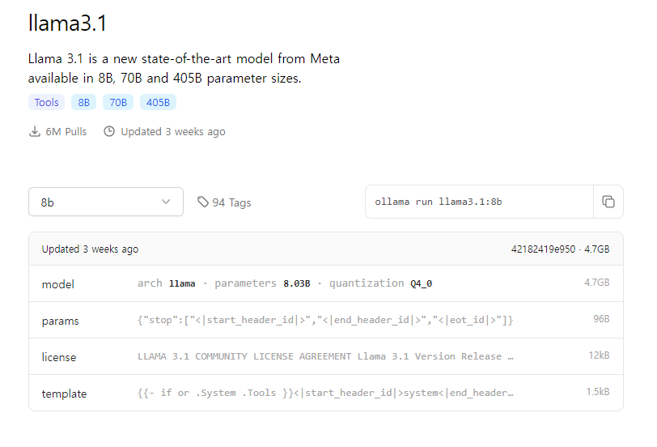
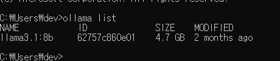
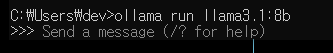

# LangChain & RAG 기초 실습

## 1. LangChain 정의
LangChain은 **대규모 언어 모델(LLM)의 기능을 확장하고 결합**하여 더 강력한 자연어 처리(NLP) 애플리케이션을 만드는 것을 목표로 합니다. GPT, BERT와 같은 다양한 언어 모델을 **연결(chain)**하여 문서 요약, 질문 응답, 텍스트 생성 등의 복잡한 작업을 해결할 수 있습니다.

- **주요 목적**: 여러 언어 모델 및 도구를 연결하여 복잡한 질문에 대한 답변을 생성하거나 특정 작업을 자동화하는 시스템을 구축하는 것.
- **예시**: 여러 LLM을 결합하여 질문에 대한 답변을 더 정확하게 제공하거나, 다양한 소스에서 데이터를 가져와 통합하는 작업.

## 2. RAG (Retrieval-Augmented Generation) 정의
RAG는 **문서 검색**과 **생성**을 결합한 기술로, 주어진 질문이나 쿼리에 대한 응답을 생성하기 전에 관련 정보를 **검색**합니다. 이는 대규모 언어 모델이 실시간 데이터에 접근할 수 없다는 문제를 해결하기 위한 기술입니다.

- **주요 목적**: 필요한 정보를 먼저 검색하고, 그 정보를 바탕으로 최종 응답을 생성하는 것.
- **예시**: "현재 서울의 날씨는?"과 같은 질문에 대해 RAG 시스템은 최신 데이터를 검색한 후, 해당 데이터를 바탕으로 응답을 생성.

## 3. 가상환경 설정 및 시작


1. 가상환경 생성:
   ```bash
   # window
   python -m venv {가상환경}
   # Mac, Linux
   python3 -m venv {가상환경}
   ```

2. 가상환경 활성화:

    ```bash
    # window
    study\Scripts\activate

    #Mac, Linux
    source {가상환경}/bin/activate
    ```

3. 가상환경 비활성화:

    ```bash
    deactivate
    ```
## LLM모델 선정(llama3.1 8b)

1. ollama 설치

2. 모델 설치

* [공식 홈페이지 설치 링크](https://ollama.com/library/llama3.1:8b)

    

* ollama를 이용한 모델 설치
    ```
    ollama run llama3.1:8b
    ```

3. 설치된 모델 확인
    ```
    ollama list
    ```
    

4. 정상 작동 확인
    ```
    ollama run llama3.1:8b
    ```

    

## 패키지에서 LLM모델 호출하기

1. models 하위 폴더를 생성하여 관리하기
    ```
    /my_project
        /models
            llama_model.py  # LLaMA 모델 관련 코드
        main.py  # 메인 실행 파일
    ```

2. llama 3.18b

    ```
    # llama_model.py
    import requests
    import json

    def get_llama_model(prompt_text, temperature=0.9):
        url = "http://localhost:11434/api/generate"
        payload = {
            "model": "llama3.1:8b",
            "prompt": prompt_text,
            "temperature": temperature
        }
        headers = {"Content-Type": "application/json"}
        response = requests.post(url, json=payload, headers=headers, stream=True)  # 스트리밍 활성화

        full_response = ""
        for line in response.iter_lines():
            if line:
                # 각 라인의 JSON 데이터에서 텍스트 부분을 추출
                try:
                    json_data = line.decode("utf-8")  # 문자열로 디코딩
                    json_obj = json.loads(json_data)  # JSON 객체로 파싱 (requests.models.json 대신 json 모듈 사용)
                    full_response += json_obj.get("response", "")  # "response" 필드 추가
                except ValueError as e:
                    print(f"Error decoding JSON: {e}")
        
        return full_response
    ```

3. main함수에서 호출하기

    ```
    # main.py
    from models.llama_model import get_llama_model  # llama_model.py에서 함수 가져오기

    if __name__ == "__main__":
        prompt = input("Enter your prompt: ")
        response = get_llama_model(prompt)
        print("LLaMA Response:", response)
    ```

## 프롬프트
용도에 맞는 프롬프트를 추가하여 활용 가능. 아래는 예시

0. 부여된 프롬프트 코드 추가
    ```
    # llama_model.py
    # 페르소나와 사용자 프롬프트 결합
    final_prompt = generate_final_prompt(prompt_text)
    ```

1. 페르소나 프롬프트
    * LLM에 페르소나를 부여하여 효과적인 모델 사용
    * 코드예시
    ```
    # persona_prompts.py

    def get_persona_prompt():
        """
        {부여하고 싶은 페르소나 입력}
        """
        persona_prompt = """
        당신은 매우 정확한 정보를 제공하는 비서입니다. 질문자가 요청한 정보를 찾고, 
        검색 시스템에서 제공한 데이터를 기반으로 가능한 한 정확하게 정보를 제공합니다. 
        만약 해당 정보를 찾을 수 없다면 솔직하게 "해당 정보를 찾지 못했습니다"라고 답변하고, 
        추가로 일반적인 지식에 기반한 답변을 제공할 수 있다면 이후에 답변을 추가하세요. 
        검색된 정보가 우선입니다.
        """
        return persona_prompt

    def generate_final_prompt(user_input):
        """
        사용자 입력과 페르소나를 결합하여 최종 프롬프트를 생성하는 함수.
        """
        persona_prompt = get_persona_prompt()
        return f"{persona_prompt} {user_input}"
    ```

## 데이터 전처리
바로 pdf를 읽을 수 있으나 전처리작업을 거치면 정확도와 속도,비용(토큰)적 이득을 볼 수 있음.

1. 1차 데이터 전처리(특수문자 제거)
    ```
    import re

    # 특수문자 제거 및 데이터 클리닝 함수
    def clean_text(text):
        # 특수문자 제거 (필요시 추가적인 정규식 적용 가능)
        text = re.sub(r'[^a-zA-Z0-9\s]', '', text)
        # 여러 공백을 하나의 공백으로 변환
        text = re.sub(r'\s+', ' ', text).strip()
        return text
    ```
2. 청크화 작업
    * 여기서는 슬라이딩 윈도우 기법을 사용했습니다.
    ```
    # preprocessing.py
    def sliding_window(text, window_size, overlap):
    """
    슬라이딩 윈도우 기법을 사용하여 텍스트를 작은 청크로 나눔.
    :param text: 입력 텍스트
    :param window_size: 한 번에 처리할 텍스트의 길이 (문자 단위)
    :param overlap: 청크 간 겹치는 구간의 길이
    :return: 슬라이딩 윈도우로 나눠진 텍스트 청크 리스트
    """
    chunks = []
    start = 0
    text_length = len(text)
    
    while start < text_length:
        end = min(start + window_size, text_length)
        chunk = text[start:end]
        chunks.append(chunk)
        start += window_size - overlap  # 다음 윈도우 시작점 계산 (겹침 부분 고려)
    
    return chunks

    # 예시 텍스트
    text = "이것은 슬라이딩 윈도우 기법을 적용한 텍스트 전처리 예제입니다. 긴 문서를 처리할 때 사용합니다."

    # 윈도우 크기와 겹침 구간 설정
    window_size = 20  # 한 번에 처리할 텍스트 길이
    overlap = 5  # 겹치는 구간

    # 슬라이딩 윈도우 적용
    chunks = sliding_window(text, window_size, overlap)

    # 결과 출력
    for i, chunk in enumerate(chunks):
        print(f"청크 {i+1}: {chunk}")
    ```

    * chunking.py
    ```
    import os
    from preprocessing import sliding_window

    # data 폴더의 모든 파일을 처리
    def load_and_process_files(data_directory, window_size, overlap):
        # data 디렉토리에서 파일 목록 불러오기
        files = [f for f in os.listdir(data_directory) if os.path.isfile(os.path.join(data_directory, f))]
        
        all_chunks = []  # 모든 파일에서 나온 텍스트 청크 저장
        
        for file in files:
            file_path = os.path.join(data_directory, file)
            with open(file_path, 'r', encoding='utf-8') as f:
                text = f.read()
            
            # 슬라이딩 윈도우 적용
            chunks = sliding_window(text, window_size, overlap)
            all_chunks.extend(chunks)  # 모든 청크를 리스트에 추가
        
        return all_chunks

    # 예시: data 폴더 경로와 슬라이딩 윈도우 파라미터 설정
    data_directory = './data'  # 루트 폴더의 data 디렉토리
    window_size = 200  # 청크의 길이 설정 (문자 수)
    overlap = 50  # 청크 간 겹치는 길이 설정

    # 파일 처리 및 슬라이딩 윈도우 적용
    all_chunks = load_and_process_files(data_directory, window_size, overlap)

    # 청크 결과 출력
    for i, chunk in enumerate(all_chunks):
        print(f"청크 {i+1}: {chunk}\n")
    ```

3. 백터화 작업
    * 여기서는 FAISS를 사용했습니다
    ```
    import faiss
    from langchain.embeddings.openai import OpenAIEmbeddings

    # 텍스트 청크를 벡터로 변환하는 함수
    def vectorize_chunks(chunks):
        # OpenAI Embeddings 사용
        embeddings = OpenAIEmbeddings()
        
        # 벡터화 진행
        chunk_vectors = [embeddings.embed_text(chunk) for chunk in chunks]
        
        return chunk_vectors

    # 벡터화 진행
    chunk_vectors = vectorize_chunks(all_chunks)

    # FAISS에 벡터 저장
    dimension = len(chunk_vectors[0])  # 벡터 차원
    index = faiss.IndexFlatL2(dimension)  # L2 거리 기반 인덱스 생성

    # 벡터 추가
    index.add(chunk_vectors)

    # 인덱스에 저장된 벡터 개수 출력
    print(f"FAISS 인덱스에 저장된 벡터 개수: {index.ntotal}")
    ```

4. 인덱싱
    ```
    import faiss

    # FAISS 인덱스 저장
    def save_faiss_index(index, file_name):
        faiss.write_index(index, file_name)

    # FAISS 인덱스 로드
    def load_faiss_index(file_name):
        index = faiss.read_index(file_name)
        return index

    # 예시: 인덱스 저장 및 로드
    index_file = "faiss_index.index"
    save_faiss_index(index, index_file)  # 인덱스 저장
    loaded_index = load_faiss_index(index_file)  # 인덱스 로드

    print(f"저장된 인덱스에서 벡터 개수: {loaded_index.ntotal}")
    ```